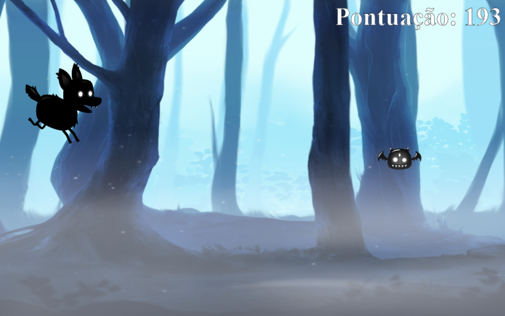

# CorreCatchoro
Um jogo side-scroller runner infinito onde você é um cachorro tentando desviar de morcegos perigosos durante a noite.

# Como jogar?

Para jogar, abra o arquivo [index.html](index.html) pelo seu navegador, clique em "Jogar" no menu superior, e clique no botão verde "Iniciar Jogo".

# Funcionalidades

- Você pode pular com 'Espaço'
- Enquanto no ar, você pode dar um segundo pulo com 'Espaço'
- Ao colidir com um morcego, você pode reiniciar o jogo com 'Enter'
- O jogo possui um sistema de pontuação que aumenta incrementalmente baseado no quão longe você foi desde que começou a tentativa
